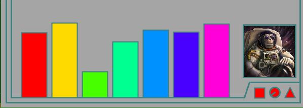
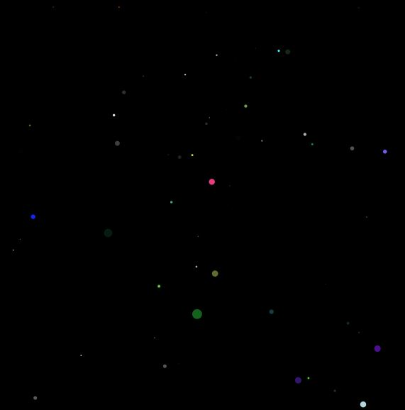
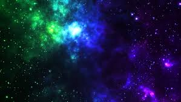
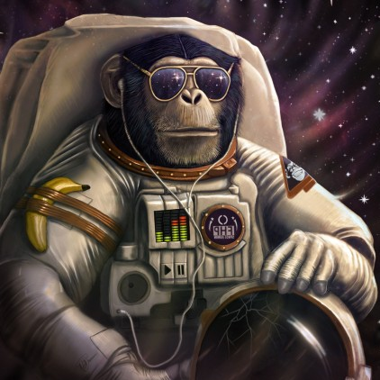

# SciFi UI Project

Name: Declan Thorne

Student Number: C17425952


# Description of the assignment

Welcome to.... SPACE! It's only you and your assistant, the Funky Space Monkey. 

This assignment takes the traditional Alien UI and adds a colourful mix of animation and interactivity using Processing.

[](https://youtu.be/42hfwCpjhIg)

# Instructions

So there is a lot going on. It's a Science Fiction UI system. There is the bars at the bottom. They let you know everything is in shape and the ship is running at max capacity.

The Black Screen in the center shows the ship we are on. And to see our destination press and hold the 'w' key. 

To see out the ship as we are travelling click the mouse. to go back, click the mouse again. 

Drag the mouse across and up the screen in any direction or pattern, the colours noticeably change to where the user is pointing.



# How it works

Using Processing the project is split up into different classes that have their methods render and update called 60 times a second.

Looking out the window of the space ship and seeing the multicoloured stars coming towards you, this is achieved using an array of 400. The stars reset once they have left the screen and they grow in size while they move towards us.

The colour bars' colours are assigned to the X axis of the mouse and the Y axis of the mouse. 

The bars in the barchart are put into an ArrayList and have their values randomly generated, these values are also stored in another ArrayList and are called using loops. 



This is code:

```Java
public class MovingBar {

    private float zY;
    private float zX;
    private float ranY;
    private float heightY;
    private float radius;

    ArrayList<Float> size = new ArrayList<Float>(7);
    ArrayList<Integer> dy = new ArrayList<Integer>(7);
    UI ui;
    
    // new MovingBar(this, (outln * 2), height - (outln * 2));
    public MovingBar(UI ui, float zX, float zY, float heightY, float radius) {
        this.ui = ui;
        this.zX = zX;
        this.zY = zY;
        this.heightY = heightY;
        this. radius = radius /8;
        for(int i = 0; i < 7; i++){
            ranY = ui.random((ui.height/4) * -1, 0);
            size.add(ranY);
            dy.add(-1);
        }
    }   
    
    public void render() {
        
        ui.stroke(127, 127, 127);
        ui.fill(255, 255, 255);
        for(int i = 0; i < 7; i++) {
            ui.fill(ui.map(i, 0, 7, 0, 255), 255, 255);
            ui.rect(zX + (radius * i), zY, 50, size.get(i));
        }
    }

    public void update() {
        for(int i = 0; i < 7; i ++) {
            size.set(i, size.get(i) + dy.get(i));
        }
        for(int i = 0; i < 7; i ++) {
            if ((size.get(i) >= heightY) && (size.get(i) <= (heightY + 5)) || (size.get(i) >= 1)) {
                dy.set(i, dy.get(i) * -1);
            }
        }
    }
}

```

# What I am most proud of in the assignment

I struggled with Processing in general and I'm glad I started this project early and kept coming back to it. Im proud of the colours I used and the overall creativity of the project along with the use of classes and focusing on *OOP techniques*. 




